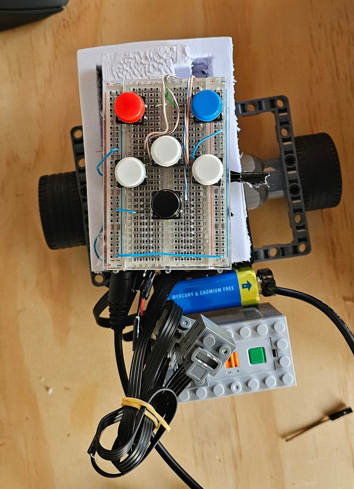

# Arduino + Lego Bee-Bot Project

This project aims to replicate the basic functionality of a Bee-Bot robot using an Arduino microcontroller. A Bee-Bot is a small, programmable, floor robot designed primarily for young children (typically ages 3-7) to introduce them to basic coding concepts.

## Project Goals

* Implement basic movement commands:
    * Forward
    * Backward
    * Left Turn
    * Right Turn
* Use push buttons for command input.
* Include buttons for:
    * Clear Program (reset command sequence)
    * Start Program (execute command sequence)
* No sensors will be used in this initial phase.



## Components Required

* Arduino Uno
* Lego DC Motors (2) with Wheels
* Motor Driver TB6612FNG
* Push Buttons (6)
* Power Source: 9V battery for Arduino, battery pack for motors
* Jumper Wires
* Breadboard

## Button Assignments

* **Forward:** Moves the Bee-Bot forward.
* **Backward:** Moves the Bee-Bot backward.
* **Left Turn:** Turns the Bee-Bot left.
* **Right Turn:** Turns the Bee-Bot right.
* **Clear Program:** Resets the stored command sequence.
* **Start Program:** Executes the stored command sequence.

### Incremental development in 4 steps:

1.  **One button:**
    * Connect a pull-up button to pin 2 to control internal led.
2.  **One motor:**
    * Connect a motor to the motor driver.
    * Connect the motor driver to the Arduino.
    * Connect one push button to control the motor.
3.  **Two motors:**
    * Connect arduino to lego chasis with 2 motors and one free wheel, using the motor driver, and the 6 buttons, using the directional ones to control the motors and the other 2 to control the motor speed
4.  **Full BeeBot:**
    * Implement storing commands and sequencing
    * Test parameters like time and speed required for a 90 degree turn
    * Let the kids have fun !
5.  **Full BeeBot (new motor driver):**
    * Update code to use [L298NH shield](https://www.diymore.cc/products/replace-l298p-for-arduino-uno-r3-dual-channel-dc-motor-driver-shield-expansion-board-l298nh-module-driving-module-mega2560-one)
    * Let the fun continue

## Wiring Diagram

```

Arduino Uno                L298NH Motor Driver Shield (diymore)
+---------+              +------------------+
|         |              |                  |
|     5V  |--------------|  5V         OUT1 |----- Motor1 +
|    3.3V |              |             OUT2 |----- Motor1 -
|    GND  |--------------|  GND        OUT3 |----- Motor2 +
|         |              |             OUT4 |----- Motor2 -
|         |              |                  |
|     D12 |--------------|  Motor A Dir     | 
|     D13 |--------------|  Motor B Dir     |
|      D3 |--------------|  PWMA            |
|     D11 |--------------|  PWMB            |
|      D9 |--------------|  Break A         |
|      D8 |--------------|  Break B         |
|      A0 |--------------|  Current Sense A |  (not used)
|      A1 |--------------|  Current Sense B |  (not used)
|         |              +-----------------+
|         |
|      D2 |----- [ Start Button   ]---> GND
|      D4 |----- [ Clear Button   ]---> GND
|      D5 |----- [ Forward Button ]---> GND
|      D6 |----- [ Left Button    ]---> GND
|      D7 |----- [ Right Button   ]---> GND
|     D10 |----- [ Back Button    ]---> GND
+---------+

Power Connections:
- Arduino: 9V battery via DC jack
- Motors (VM): 9V battery pack (6x AA batteries)

```

## Future work / ideas

* Add a camera and use [COCO SSD](https://github.com/tensorflow/tfjs-models/blob/master/coco-ssd) to find a person in a frame and control motors to follow it
* Add microphone and [Speech Commands](https://github.com/tensorflow/tfjs-models/blob/master/speech-commands) to control the BeeBot via voice commands